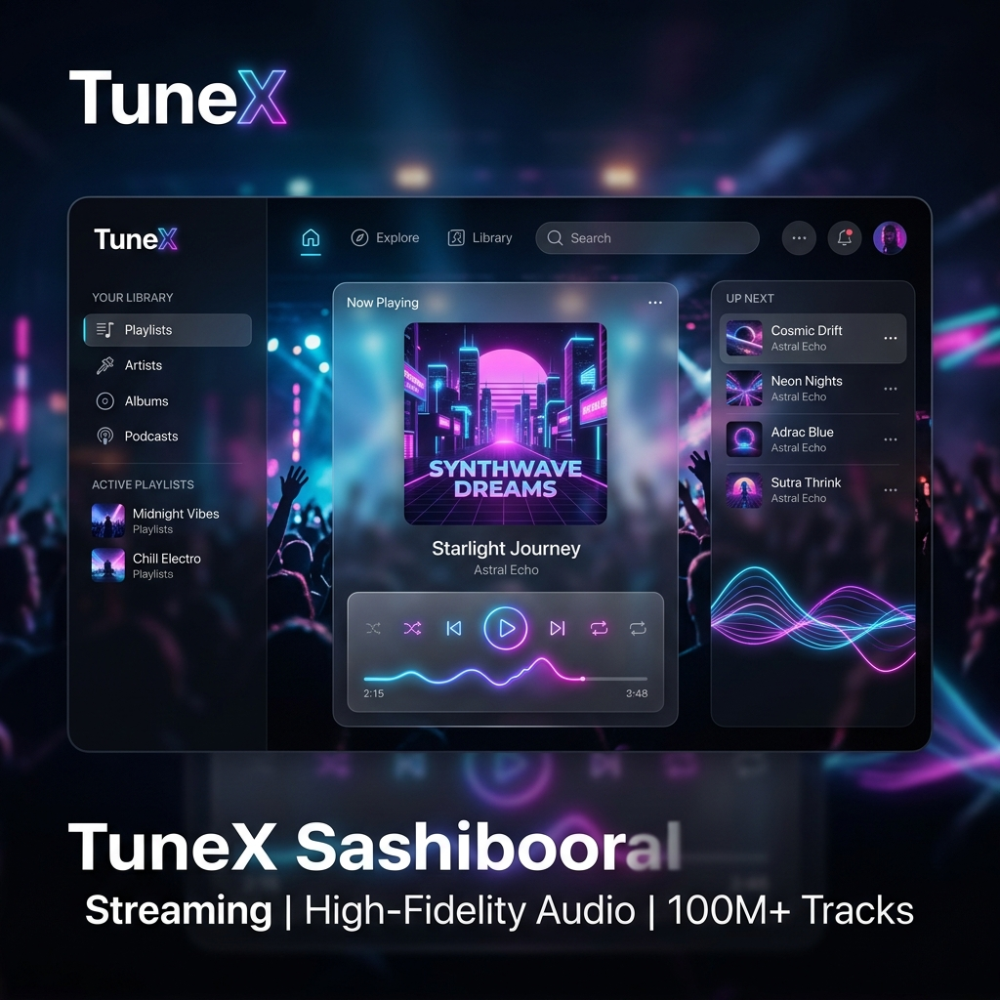

# 🎵 TuneX - Premium Web Music Experience



> **Experience the future of music streaming.** TuneX is a high-fidelity, premium web music player designed for audiophiles who crave a seamless, "Spotify-killer" interface with the power of the global music library.

[](https://vercel.com/new)


---

## ✨ Features that WOW

*   **🌌 Ambient Glow Engine**: Dynamic UI background that adaptively changes based on the currently playing track's artwork.
*   **🔍 Global Search**: Instant access to millions of tracks, artists, and trending hits.
*   **📂 Smart Library**: Create and manage your own high-class collections and playlists.
*   **💾 Local-First Persistence**: Your history and playlists are stored safely in your browser (LocalStorage)—No database needed!
*   **📱 Fluid Responsiveness**: Designed for every screen, from your 4K Desktop to your mobile device.
*   **🎧 Predictive Queue**: Intelligent "Up Next" suggestions based on your current vibe.
*   **📜 Lyrics Integration**: High-fidelity lyrics sync for your favorite tracks.

---

## 🛠️ The Tech Stack

| Component | Technology |
| :--- | :--- |
| **Frontend** | Vanilla JS (ES6+), HTML5, CSS3 (Premium Glassmorphism) |
| **Backend** | Python (Flask Serverless) |
| **API** | Vercel Python Runtime |
| **Engines** | YouTube IFrame API, yt-dlp, Lucide Icons |
| **Storage** | Browser LocalStorage (Zero-DB Architecture) |

---

## 🚀 One-Click Deployment (Vercel)

TuneX is pre-configured for Vercel.

1.  **Fork** this repository.
2.  Go to **[Vercel Dashboard](https://vercel.com/new)**.
3.  Import your fork and click **Deploy**.
4.  *Magic happens!* Your premium player is live.

### Local Development

```bash
# 1. Clone the repo
git clone https://github.com/yashuu213/tunex.git

# 2. Install dependencies
pip install -r requirements.txt

# 3. Run the development server
python api/index.py
```

---

## 🎨 Design Philosophy

TuneX isn't just a player; it's a **vibe**. We use **Outfit (Google Fonts)** for a modern typography feel, **Lucide Icons** for crisp visual cues, and a custom **Glassmorphism CSS Framework** that makes the UI feel light, airy, and expensive.

---

## 🤝 Contributing

Love TuneX? Fork it, star it, and send a PR! Let's build the best open-source music experience together.

---

## 📜 License

MIT License - feel free to use it, hack it, and make it yours.

---

<p align="center">Made with ❤️ for the Music Community</p>
